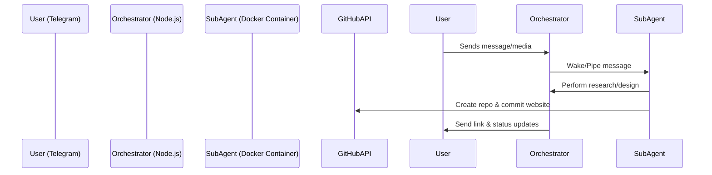

# WebAgentBot — Telegram-to-GitHub Website Creator

WebAgentBot is an AI-powered website builder that turns your business ideas into reality over Telegram. It manages the entire lifecycle of a website project: from discovery and research to automated GitHub repository creation and deployment.

Built on an isolated, containerized architecture for maximum security and privacy.

## ✨ Key Features

- **Telegram-Ready**: Start building your website right from your phone.
- **Automated GitHub Pipeline**: Automatically creates repositories, milestones, and commits code.
- **SEO & Domain Intelligence**: Built-in DNS checks and SEO meta-tag generation.
- **Media Analysis**: Send photos or videos of your brand; the bot analyzes them once and remembers the context.
- **Message Batching**: A 5-second "quiet period" ensures cohesive responses by collecting multiple user messages.
- **Warm Session Caching**: In-memory session persistence for nearly instantaneous "warm" responses.
- **Context Summarization**: Automatically summarizes long conversations to keep relevant brand decisions while minimizing token usage.
- **Isolated Sandboxing**: Each client runs in their own Docker container for total privacy.

---

## 🚀 How to Start

### 1. Prerequisites
- **Docker**: Required for isolated agent environments.
- **Node.js**: v20 or higher.
- **Git**: For pushing to your website repositories.

### 2. Installation
Clone the repository and install dependencies:

```bash
git clone https://github.com/SarielGil/WebAgentBot.git
cd WebAgentBot
npm install
```

### 3. Interactive Setup
Run the onboarding script to configure your API keys (Telegram, GitHub, Google Gemini):

```bash
npm run setup
```

### 4. Running the Bot
Start the orchestrator in development mode:

```bash
npm run dev
```

---

## 🎮 How to Use (For Business Owners)

Once the bot is running, interact with it on Telegram:

1.  **Start Chat**: Search for your bot on Telegram and send a message (e.g., `"Hi! I want to build a website for my flower shop."`).
2.  **Discovery**: The bot will ask for your brand name, social links, and some details about your business.
3.  **Media**: Upload your logo, shop photos, or even a video tour. The bot analyzes these once and remembers them.
4.  **Design Selection**: The bot will present 3 design options. Choose one by replying.
5.  **Domain Check**: Ask the bot to suggest domains. It will check availability in real-time.
6.  **GitHub Repo**: Once you're happy, the bot creates a GitHub repository and commits your new website code.

---

## 🏗️ Architecture

WebAgentBot uses a hub-and-spoke model where a central **Orchestrator** manages communication and spawns **Sub-Agents** in isolated containers.



---

## 🗺️ Roadmap

- **Phase 1-8 (Complete)**: Discovery flow, context optimization, media handling, and master orchestration.
- **Phase 9-10 (Complete)**: Workflow stabilization, message batching, and session caching.
- **Future**: Client self-service UI and enhanced AEO standards.

---

## 🔒 Security & Privacy

Every chat session is isolated at the OS level using Docker. Sub-agents can only see the files explicitly mounted for that specific client. No shared memory between different project containers.

## 📄 License

MIT © [Sariel Gilat](https://github.com/SarielGil)

